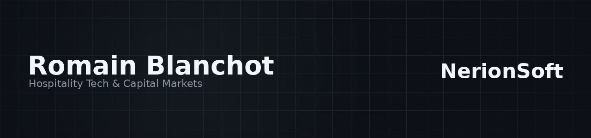

  

<h1 align="center">👋 Romain Blanchot</h1>

<strong>CEO @ NerionSoft | ML-Focused Software Engineer @ SG CIB | DSI @ Hotel La Louisiane</strong>

  
  
  
  

  <a href="https://nerionsoft.com">nerionsoft.com</a> · <a href="https://www.romainblanchot.com">romainblanchot.com</a> · <a href="https://www.linkedin.com/in/romainblanchot">linkedin.com/in/romainblanchot</a> · <a href="mailto:romain.blanchot@nerionsoft.com">romain.blanchot@nerionsoft.com</a>

---

## About

I build software across two worlds: **hospitality/F&B** and **capital markets**. That dual focus is what drives everything I ship.

Through **NerionSoft**, I help hospitality and food & beverage operators automate their operations, build custom platforms, and scale with purpose-built SaaS. As **DSI at Hotel La Louisiane** (Paris), I own the full IT scope: infrastructure, network, web platforms, and internal tools for a historic boutique hotel.

At **SG CIB**, I work as an ML-focused software engineer in front office technology, building pricing models, pre-trade decision systems, and trading tools for the markets desk.

ESIEA (Paris) and KMUTT (Bangkok) alumni.

---

## NerionSoft

NerionSoft delivers software services tailored to hospitality and F&B businesses. We handle the technical side so operators can focus on their craft.

**What we deliver:**
- Backend services and APIs for booking, inventory, and operations
- Business process automation (scheduling, invoicing, reporting)
- Web platforms and SaaS products for multi-site management
- Infrastructure setup, deployment pipelines, and ongoing maintenance

---

## Hotel La Louisiane, DSI

Full IT ownership for a historic Parisian boutique hotel. I design, deploy, and maintain every layer of the technical stack.

- On-prem and cloud infrastructure, network architecture, security
- Web platforms (booking, public site) and internal management tools
- Vendor coordination, system integration, and operational continuity

---

## SG CIB, Front Office Technology

ML pricing models and pre-trade decision systems for the trading floor. I design and ship backend services that feed real-time analytics and risk indicators to traders.

- Machine learning models for pricing and calibration
- Pre-trade systems and execution tooling
- Backend services in Spring/Java, deployed on Kubernetes

---

## Engineering Principles

- Build simple systems before complex ones.
- Prefer boring infrastructure when reliability matters.
- Document decisions, not only code.
- Automate repetitive work, but keep human review where risk is high.

---

## Tech Stack

| Category | Technologies |
|----------|-------------|
| **Languages** |      |
| **Backend & Frameworks** |    |
| **Data & ML** |     |
| **DevOps & Infra** |       |
| **Cloud & Tools** |    |

---

  <a href="https://nerionsoft.com">nerionsoft.com</a> · <a href="https://www.romainblanchot.com">romainblanchot.com</a> · <a href="mailto:romain.blanchot@nerionsoft.com">romain.blanchot@nerionsoft.com</a>

